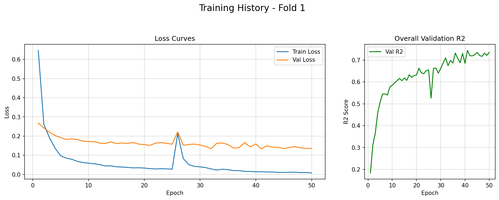

# 训练知识

### 图片数据回归预测任务+目标值 targets 分布存在严重**右偏**且存在数学关系约束

```py
dead = total - gdm
clover = gdm - green
```

对于这样的情况，首先想到的就是对于 `targets` 做数据分布迁移，使其尽可能近似于**正态分布**。

因为我的`targets` 数据都是非负值，所以优先尝试做 `log1p` 变换。

本来是想去做一个归一化的，但是我的数据量级分布在 `0-100` ，我认为做 `log1p` 的同时也将数值缩减到了合适的范围，因为前期的实验过程中确实发现了归一化带来的显著效果提升。

但是在做变换的过程中，思维的构建还是存在多种情况：

1. 直接训练一个预测输出在 `log1p` 空间的模型，然后损失自然也是方便的利于在 `log1p` 空间计算，但是这样一来后续计算指标需要反变换为原始空间，同时数学关系无法在训练的时候于原始空间建立，只能依赖后处理进行变换。（这个也是之前的实验中选择的处理方法）
2. **模型预测输出还是建立在原始数值空间的，但是训练 (主要是`loss`的计算) 建立在 `log1p` 空间**，这样的好处是：改动小，易理解，数学关系数学容易建立，实现了相关的目的。

经过实验，`log1p` 变换之后的 损失显著降低。



变换之前损失在 `10-20`之间，变换之后在`0-1`之间，**于是我开始思考是否需要调大学习率？**经过查阅资料有以下我认同的观点：

对目标做了 `log1p`，预测和目标都变小了，损失函数变小，梯度就会变小；此时 `lr `不变，实际的参数更新幅度也自然会变小；

```py
param = param - learning_rate * gradient
```

但如果主动将` lr `调大，就可能抵消了这种稳定性；只要当前训练健康，没有出现多个`epoch`的`loss`和`metrics` 在某个区间内来回震荡的情况（即因更新步幅太小，导致**陷入了局部最优**），就不需要去调整 `lr`。

### 辅助学习+辅助Loss不断震荡